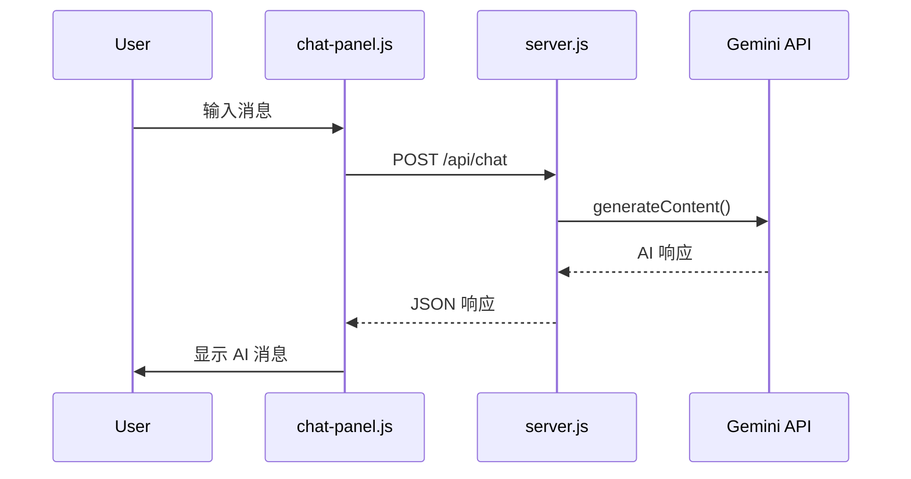

# Gemini AI Chat 接入方案

## 架构设计



## 实现步骤

### 1. 创建 Express 后端 ([server.js](server.js))

创建简单的 Express 服务器，包含：

- 静态文件服务（替代 http-server）
- `/api/chat` 端点代理 Gemini API 调用
- 从环境变量读取 `GEMINI_API_KEY`
```javascript
// 核心逻辑
app.post('/api/chat', async (req, res) => {
  const { message, history } = req.body;
  const model = genAI.getGenerativeModel({ model: 'gemini-2.0-flash' });
  const result = await model.generateContent(message);
  res.json({ response: result.response.text() });
});
```


### 2. 更新 [package.json](package.json)

添加依赖和启动脚本：

- `@google/generative-ai` - Gemini SDK
- `express` - 后端框架
- `dotenv` - 环境变量
- `cors` - 跨域支持

### 3. 创建 [.env.example](.env.example)

```
GEMINI_API_KEY=your_api_key_here
```

### 4. 修改 [chat-panel.js](chat-panel.js)

添加 AI 聊天功能：

```javascript
async callGeminiAPI(message) {
  const response = await fetch('/api/chat', {
    method: 'POST',
    headers: { 'Content-Type': 'application/json' },
    body: JSON.stringify({ message, history: this.chatHistory })
  });
  return response.json();
}
```

主要改动：

- 添加 `chatHistory` 数组维护对话上下文
- 添加 `callGeminiAPI()` 方法
- 修改 `defaultResponse()` 为异步调用 API
- 添加 loading 状态显示

### 5. 更新 [.gitignore](.gitignore)

添加 `.env` 和 `node_modules`

## 文件变更清单

| 文件 | 操作 |

|------|------|

| `server.js` | 新建 - Express 后端 |

| `package.json` | 修改 - 添加依赖和脚本 |

| `.env.example` | 新建 - 环境变量模板 |

| `.gitignore` | 修改 - 排除敏感文件 |

| `chat-panel.js` | 修改 - 添加 API 调用逻辑 |

## 使用方式

```bash
# 1. 安装依赖
npm install

# 2. 创建 .env 文件并填入 API Key
cp .env.example .env

# 3. 启动服务
npm run dev
```